# Kiến Trúc Hệ Thống — App Quản Lý Cho Thuê Nhà

**Ngày:** 2026-04-16  
**Phiên bản:** 1.0  
**Nền tảng:** React Native (iOS + Android)  
**Ngôn ngữ:** Tiếng Việt xuyên suốt

---

## 1. System Overview Diagram (Mermaid)

```mermaid
graph TB
    subgraph CLIENT["Client Layer — React Native (Expo)"]
        RN[React Native App]
        RN --> AuthScreen[Màn hình Đăng nhập / Đăng ký]
        RN --> LandlordStack[Stack Chủ Nhà]
        RN --> TenantStack[Stack Người Thuê]
        LandlordStack --> PropMgmt[Quản lý BĐS & Phòng]
        LandlordStack --> ContractMgmt[Quản lý Hợp đồng]
        LandlordStack --> PaymentMgmt[Quản lý Thanh toán]
        LandlordStack --> Reports[Báo cáo Tài chính]
        LandlordStack --> MaintenanceMgmt[Quản lý Bảo trì]
        TenantStack --> MyRoom[Phòng của tôi]
        TenantStack --> PayBill[Thanh toán Hóa đơn]
        TenantStack --> SubmitMaint[Gửi Yêu cầu Bảo trì]
        TenantStack --> ChecklistView[Biên bản Bàn giao]
        RN --> ChatUI[Chat 1-1]
        RN --> NotifCenter[Trung tâm Thông báo]
    end

    subgraph BACKEND["Backend Layer — NestJS on Railway/Render"]
        API[REST API — NestJS]
        WS[WebSocket Gateway — Socket.io]
        PDFSvc[PDF Service — Puppeteer]
        WebhookSvc[Payment Webhook Handler]
        NotifSvc[Notification Service]
        API --> PDFSvc
        API --> NotifSvc
        WebhookSvc --> API
    end

    subgraph SUPABASE["Supabase (BaaS)"]
        SupaAuth[Supabase Auth]
        SupaDB[(PostgreSQL)]
        SupaStorage[Supabase Storage]
        SupaRealtime[Supabase Realtime]
    end

    subgraph EXTERNAL["External Services"]
        FCM[Firebase FCM]
        Momo[MoMo API]
        ZaloPay[ZaloPay API]
        VietQR[VietQR]
        GoogleOAuth[Google OAuth]
        FacebookOAuth[Facebook OAuth]
    end

    RN <-->|HTTPS REST| API
    RN <-->|WebSocket| WS
    RN <-->|Realtime sub| SupaRealtime
    RN -->|Auth| SupaAuth
    RN -->|File upload| SupaStorage
    API <-->|Read/Write| SupaDB
    API -->|Push| FCM
    FCM -->|Push notification| RN
    API <-->|Payment request| Momo
    API <-->|Payment request| ZaloPay
    API <-->|QR generation| VietQR
    Momo -->|Webhook| WebhookSvc
    ZaloPay -->|Webhook| WebhookSvc
    VietQR -->|Webhook| WebhookSvc
    SupaAuth <-->|Social| GoogleOAuth
    SupaAuth <-->|Social| FacebookOAuth
```



---

## 2. Recommended Tech Stack & Rationale

### Frontend

| Thành phần | Lựa chọn | Lý do |
|---|---|---|
| Framework | **React Native + Expo (Managed → Bare workflow)** | Expo cung cấp toolchain nhanh; bare workflow khi cần native module (camera, biometric). Expo SDK 52+ hỗ trợ New Architecture. |
| Navigation | **React Navigation v7** | Tiêu chuẩn de-facto cho RN, hỗ trợ stack/tab/drawer. |
| State | **Zustand + TanStack Query v5** | Zustand nhẹ cho global UI state; TanStack Query cho server cache + pagination + optimistic updates. |
| UI Kit | **React Native Paper** (Material Design 3) | Sẵn bộ component chuẩn, dễ tuỳ chỉnh sang màu Việt. |
| Forms | **React Hook Form + Zod** | Hiệu suất cao, validation type-safe. |
| PDF Viewer | **react-native-pdf** | Xem hợp đồng PDF trực tiếp trong app. |
| E-signature | **react-native-signature-canvas** | Vẽ chữ ký trên canvas, xuất PNG base64. |
| Chat | **Socket.io client** | Kết hợp với NestJS WebSocket Gateway. |
| Push | **@react-native-firebase/messaging** | FCM native. |
| Image/Media | **expo-image-picker + expo-camera** | Chụp ảnh yêu cầu bảo trì. |
| Payment QR | **react-native-qrcode-svg** | Hiển thị mã QR VietQR. |
| Charts | **Victory Native** | Biểu đồ báo cáo tài chính. |

### Backend

| Thành phần | Lựa chọn | Lý do |
|---|---|---|
| Framework | **NestJS (Node.js)** | Module-based, DI container, decorator-driven, dễ scale; TypeScript native. |
| Database | **PostgreSQL via Supabase** | ACID, Row Level Security (RLS), Realtime built-in. Không cần tự host DB. |
| ORM | **Prisma** | Type-safe, migration tốt, schema-first. |
| Realtime | **Supabase Realtime + Socket.io** | Supabase Realtime cho chat messages & notifications; Socket.io cho các event real-time phức tạp hơn (typing indicator, presence). |
| Auth | **Supabase Auth** | Hỗ trợ email/password + Google + Facebook + JWT; tích hợp RLS tự động. |
| File Storage | **Supabase Storage** | S3-compatible, dễ tích hợp, CDN edge. Dùng bucket riêng cho: avatars, contracts, checklist-photos, maintenance-photos. |
| PDF Generation | **Puppeteer (Headless Chrome)** | Render HTML template → PDF chất lượng cao; hỗ trợ font tiếng Việt (NotoSans). |
| Push Notifications | **Firebase Admin SDK (FCM)** | Đa nền tảng iOS + Android, reliable delivery. |
| Queue | **BullMQ + Redis** | Queue cho PDF generation, email, push notification batch. |
| Hosting | **Railway.app** | Deploy NestJS container + Redis; free tier ổn cho MVP. |

### Payment

| Gateway | Lý do |
|---|---|
| **MoMo API** | Phổ biến nhất Việt Nam, webhook JSON đơn giản. |
| **ZaloPay API** | Thị phần lớn, hỗ trợ QR + app-to-app. |
| **VietQR** | Standard QR liên ngân hàng, dùng cho chuyển khoản thủ công có xác nhận tự động. |

---

## 3. Complete Folder / File Structure

```
rental-app/
├── apps/
│   └── mobile/                          # React Native (Expo)
│       ├── app.json
│       ├── babel.config.js
│       ├── metro.config.js
│       ├── tsconfig.json
│       ├── .env.local                   # SUPABASE_URL, SUPABASE_ANON_KEY, API_URL
│       │
│       ├── assets/
│       │   ├── fonts/                   # NotoSans-Vietnamese
│       │   ├── images/
│       │   └── icons/
│       │
│       ├── src/
│       │   ├── app/                     # Expo Router or RN Navigation root
│       │   │   ├── index.tsx            # Entry, redirect to auth or main
│       │   │   ├── _layout.tsx
│       │   │   ├── (auth)/
│       │   │   │   ├── login.tsx
│       │   │   │   ├── register.tsx
│       │   │   │   └── role-select.tsx
│       │   │   ├── (landlord)/
│       │   │   │   ├── _layout.tsx      # Bottom tab navigator
│       │   │   │   ├── dashboard.tsx
│       │   │   │   ├── properties/
│       │   │   │   │   ├── index.tsx    # Danh sách BĐS
│       │   │   │   │   ├── [id].tsx     # Chi tiết BĐS
│       │   │   │   │   ├── create.tsx
│       │   │   │   │   └── rooms/
│       │   │   │   │       ├── index.tsx
│       │   │   │   │       ├── [roomId].tsx
│       │   │   │   │       └── create.tsx
│       │   │   │   ├── contracts/
│       │   │   │   │   ├── index.tsx
│       │   │   │   │   ├── [id].tsx
│       │   │   │   │   └── create.tsx
│       │   │   │   ├── invoices/
│       │   │   │   │   ├── index.tsx
│       │   │   │   │   └── [id].tsx
│       │   │   │   ├── maintenance/
│       │   │   │   │   ├── index.tsx
│       │   │   │   │   └── [id].tsx
│       │   │   │   ├── reports/
│       │   │   │   │   └── index.tsx
│       │   │   │   └── chat/
│       │   │   │       ├── index.tsx    # Danh sách hội thoại
│       │   │   │       └── [conversationId].tsx
│       │   │   └── (tenant)/
│       │   │       ├── _layout.tsx
│       │   │       ├── dashboard.tsx
│       │   │       ├── my-room.tsx
│       │   │       ├── invoices/
│       │   │       │   ├── index.tsx
│       │   │       │   └── [id].tsx     # Chi tiết + nút thanh toán
│       │   │       ├── maintenance/
│       │   │       │   ├── index.tsx
│       │   │       │   └── create.tsx
│       │   │       ├── checklist/
│       │   │       │   └── [contractId].tsx
│       │   │       └── chat/
│       │   │           └── [conversationId].tsx
│       │   │
│       │   ├── components/
│       │   │   ├── common/
│       │   │   │   ├── AppButton.tsx
│       │   │   │   ├── AppInput.tsx
│       │   │   │   ├── AppCard.tsx
│       │   │   │   ├── AppModal.tsx
│       │   │   │   ├── AppBadge.tsx
│       │   │   │   ├── LoadingOverlay.tsx
│       │   │   │   ├── EmptyState.tsx
│       │   │   │   └── ErrorBoundary.tsx
│       │   │   ├── auth/
│       │   │   │   ├── SocialLoginButtons.tsx
│       │   │   │   └── RoleSelector.tsx
│       │   │   ├── property/
│       │   │   │   ├── PropertyCard.tsx
│       │   │   │   ├── RoomStatusBadge.tsx
│       │   │   │   └── RoomCalendar.tsx
│       │   │   ├── contract/
│       │   │   │   ├── ContractForm.tsx
│       │   │   │   ├── SignaturePad.tsx
│       │   │   │   └── ContractPDFViewer.tsx
│       │   │   ├── payment/
│       │   │   │   ├── InvoiceCard.tsx
│       │   │   │   ├── PaymentMethodSelector.tsx
│       │   │   │   ├── QRPaymentSheet.tsx
│       │   │   │   └── PaymentHistoryItem.tsx
│       │   │   ├── maintenance/
│       │   │   │   ├── TicketCard.tsx
│       │   │   │   ├── StatusStepper.tsx
│       │   │   │   ├── MediaUploader.tsx
│       │   │   │   └── RatingInput.tsx
│       │   │   ├── chat/
│       │   │   │   ├── MessageBubble.tsx
│       │   │   │   ├── ChatInput.tsx
│       │   │   │   └── ConversationListItem.tsx
│       │   │   ├── checklist/
│       │   │   │   ├── ChecklistItem.tsx
│       │   │   │   └── ChecklistSection.tsx
│       │   │   └── reports/
│       │   │       ├── MonthlyChart.tsx
│       │   │       └── TransactionRow.tsx
│       │   │
│       │   ├── hooks/
│       │   │   ├── useAuth.ts
│       │   │   ├── useProperties.ts
│       │   │   ├── useRooms.ts
│       │   │   ├── useContracts.ts
│       │   │   ├── useInvoices.ts
│       │   │   ├── usePayments.ts
│       │   │   ├── useDeposits.ts
│       │   │   ├── useChecklist.ts
│       │   │   ├── useMaintenance.ts
│       │   │   ├── useNotifications.ts
│       │   │   ├── useChat.ts
│       │   │   ├── useReports.ts
│       │   │   └── useFCMToken.ts
│       │   │
│       │   ├── store/                   # Zustand stores
│       │   │   ├── authStore.ts
│       │   │   ├── uiStore.ts           # loading, modals, toasts
│       │   │   ├── chatStore.ts         # unread count, active conversation
│       │   │   └── notificationStore.ts # badge count
│       │   │
│       │   ├── services/
│       │   │   ├── api/
│       │   │   │   ├── client.ts        # Axios instance + interceptors
│       │   │   │   ├── auth.api.ts
│       │   │   │   ├── properties.api.ts
│       │   │   │   ├── rooms.api.ts
│       │   │   │   ├── contracts.api.ts
│       │   │   │   ├── invoices.api.ts
│       │   │   │   ├── payments.api.ts
│       │   │   │   ├── deposits.api.ts
│       │   │   │   ├── checklist.api.ts
│       │   │   │   ├── maintenance.api.ts
│       │   │   │   ├── notifications.api.ts
│       │   │   │   ├── chat.api.ts
│       │   │   │   └── reports.api.ts
│       │   │   ├── supabase.ts          # Supabase client init
│       │   │   ├── socket.ts            # Socket.io client singleton
│       │   │   ├── fcm.ts               # FCM token + foreground handler
│       │   │   └── storage.ts           # AsyncStorage wrappers
│       │   │
│       │   ├── types/
│       │   │   ├── models.ts            # All entity interfaces (see Section 4)
│       │   │   ├── api.ts               # Request/response DTOs
│       │   │   ├── navigation.ts        # RN Navigator param lists
│       │   │   └── env.d.ts
│       │   │
│       │   ├── utils/
│       │   │   ├── format.ts            # VND currency, date-fns vi locale
│       │   │   ├── validators.ts        # Zod schemas
│       │   │   ├── permissions.ts       # Camera, media permissions
│       │   │   └── constants.ts         # Room statuses, ticket statuses, etc.
│       │   │
│       │   ├── i18n/
│       │   │   └── vi.ts                # All Vietnamese strings (single locale)
│       │   │
│       │   └── theme/
│       │       ├── colors.ts
│       │       ├── typography.ts
│       │       └── spacing.ts
│       │
│       └── __tests__/
│           ├── components/
│           └── hooks/
│
└── apps/
    └── backend/                         # NestJS
        ├── prisma/
        │   ├── schema.prisma
        │   └── migrations/
        ├── src/
        │   ├── main.ts
        │   ├── app.module.ts
        │   ├── config/
        │   │   ├── configuration.ts
        │   │   └── validation.ts
        │   ├── common/
        │   │   ├── decorators/
        │   │   ├── filters/             # Global exception filter
        │   │   ├── guards/              # JwtAuthGuard, RolesGuard
        │   │   ├── interceptors/        # Logging, transform
        │   │   └── pipes/               # ZodValidationPipe
        │   ├── modules/
        │   │   ├── auth/
        │   │   │   ├── auth.module.ts
        │   │   │   ├── auth.controller.ts
        │   │   │   ├── auth.service.ts
        │   │   │   └── strategies/      # JWT strategy
        │   │   ├── users/
        │   │   ├── properties/
        │   │   ├── rooms/
        │   │   ├── contracts/
        │   │   │   ├── contracts.service.ts
        │   │   │   └── pdf/
        │   │   │       ├── pdf.service.ts
        │   │   │       └── templates/
        │   │   │           └── contract.html
        │   │   ├── invoices/
        │   │   ├── payments/
        │   │   │   ├── payments.service.ts
        │   │   │   ├── webhook/
        │   │   │   │   ├── momo.webhook.ts
        │   │   │   │   ├── zalopay.webhook.ts
        │   │   │   │   └── vietqr.webhook.ts
        │   │   │   └── providers/
        │   │   │       ├── momo.provider.ts
        │   │   │       └── zalopay.provider.ts
        │   │   ├── deposits/
        │   │   ├── checklist/
        │   │   ├── maintenance/
        │   │   ├── notifications/
        │   │   │   ├── notifications.service.ts
        │   │   │   └── fcm.service.ts
        │   │   ├── chat/
        │   │   │   ├── chat.gateway.ts  # Socket.io gateway
        │   │   │   ├── chat.service.ts
        │   │   │   └── chat.module.ts
        │   │   └── reports/
        │   └── database/
        │       └── prisma.service.ts
        ├── test/
        ├── Dockerfile
        └── .env
```

---

## 4. Data Models (TypeScript Interfaces)

```typescript
// ─── ENUMS ───────────────────────────────────────────────────────────────────

export type UserRole = 'chu_nha' | 'nguoi_thue';

export type RoomStatus = 'trong' | 'da_thue' | 'dang_sua_chua';

export type ContractStatus = 'nhap' | 'cho_ky' | 'hieu_luc' | 'het_han' | 'da_huy';

export type InvoiceStatus = 'chua_thanh_toan' | 'da_thanh_toan' | 'qua_han';

export type PaymentMethod = 'momo' | 'zalopay' | 'vietqr' | 'tien_mat';

export type PaymentStatus = 'cho_xu_ly' | 'thanh_cong' | 'that_bai' | 'hoan_tien';

export type DepositStatus = 'dang_giu' | 'da_hoan_tra' | 'da_tru';

export type MaintenanceStatus =
  | 'cho_xu_ly'
  | 'dang_xu_ly'
  | 'da_giao_tho'
  | 'hoan_thanh'
  | 'da_huy';

export type ChecklistPhase = 'ban_giao' | 'tra_phong';

export type NotificationType =
  | 'nhac_thanh_toan'
  | 'hop_dong_sap_het_han'
  | 'cap_nhat_bao_tri'
  | 'thong_bao_chung'
  | 'tin_nhan_moi';

// ─── USER ────────────────────────────────────────────────────────────────────

export interface User {
  id: string;                   // UUID, mirrors Supabase auth.users.id
  email: string;
  fullName: string;             // Họ và tên
  phone: string;
  role: UserRole;
  avatarUrl: string | null;
  fcmToken: string | null;      // Firebase Cloud Messaging device token
  isVerified: boolean;
  createdAt: string;            // ISO 8601
  updatedAt: string;
}

// ─── PROPERTY ────────────────────────────────────────────────────────────────

export interface Property {
  id: string;
  landlordId: string;           // FK → User
  name: string;                 // Tên toà nhà / khu nhà
  address: string;
  ward: string;                 // Phường/Xã
  district: string;             // Quận/Huyện
  city: string;                 // Tỉnh/Thành phố
  description: string | null;
  imageUrls: string[];          // Supabase Storage URLs
  electricityRate: number;      // VND per kWh
  waterRate: number;            // VND per m³
  totalRooms: number;           // Derived, can be a view
  createdAt: string;
  updatedAt: string;
}

// ─── ROOM ────────────────────────────────────────────────────────────────────

export interface Room {
  id: string;
  propertyId: string;           // FK → Property
  roomNumber: string;           // "101", "A2", etc.
  floor: number | null;
  area: number;                 // m²
  baseRent: number;             // VND/tháng
  maxOccupants: number;
  status: RoomStatus;
  amenities: string[];          // ["Điều hoà", "Nóng lạnh", "Ban công"]
  imageUrls: string[];
  notes: string | null;
  currentContractId: string | null;  // FK → Contract (active)
  createdAt: string;
  updatedAt: string;
}

// ─── CONTRACT ────────────────────────────────────────────────────────────────

export interface Contract {
  id: string;
  roomId: string;               // FK → Room
  landlordId: string;           // FK → User
  tenantId: string;             // FK → User
  startDate: string;            // YYYY-MM-DD
  endDate: string;              // YYYY-MM-DD
  monthlyRent: number;          // VND
  depositAmount: number;        // VND
  paymentDueDay: number;        // 1–28, ngày đóng tiền hàng tháng
  electricityStartReading: number;
  waterStartReading: number;
  terms: string;                // Điều khoản hợp đồng (rich text / markdown)
  status: ContractStatus;
  pdfUrl: string | null;        // Supabase Storage URL sau khi generate
  landlordSignatureUrl: string | null;
  tenantSignatureUrl: string | null;
  landlordSignedAt: string | null;
  tenantSignedAt: string | null;
  conversationId: string | null; // FK → ChatConversation (auto-created)
  createdAt: string;
  updatedAt: string;
}

// ─── INVOICE ─────────────────────────────────────────────────────────────────

export interface Invoice {
  id: string;
  contractId: string;           // FK → Contract
  roomId: string;
  tenantId: string;
  landlordId: string;
  billingMonth: string;         // "2026-04" (YYYY-MM)
  dueDate: string;              // YYYY-MM-DD
  baseRent: number;
  electricityPrevReading: number;
  electricityCurrentReading: number;
  electricityUsage: number;     // Derived: current - prev
  electricityAmount: number;    // usage * rate
  waterPrevReading: number;
  waterCurrentReading: number;
  waterUsage: number;
  waterAmount: number;
  otherFees: InvoiceFee[];      // Phí khác (rác, dịch vụ...)
  totalAmount: number;          // Sum of all
  status: InvoiceStatus;
  paidAt: string | null;
  notes: string | null;
  createdAt: string;
  updatedAt: string;
}

export interface InvoiceFee {
  name: string;                 // "Phí rác", "Phí dịch vụ"
  amount: number;
}

// ─── PAYMENT ─────────────────────────────────────────────────────────────────

export interface Payment {
  id: string;
  invoiceId: string;            // FK → Invoice
  contractId: string;
  tenantId: string;
  landlordId: string;
  amount: number;               // VND
  method: PaymentMethod;
  status: PaymentStatus;
  gatewayTransactionId: string | null;  // MoMo/ZaloPay transaction ID
  gatewayOrderId: string;       // Our internal order ID sent to gateway
  gatewayResponse: Record<string, unknown> | null;  // Raw webhook payload
  paidAt: string | null;
  failureReason: string | null;
  createdAt: string;
  updatedAt: string;
}

// ─── DEPOSIT ─────────────────────────────────────────────────────────────────

export interface Deposit {
  id: string;
  contractId: string;           // FK → Contract
  tenantId: string;
  landlordId: string;
  amount: number;               // VND
  status: DepositStatus;
  collectedAt: string | null;
  collectionMethod: PaymentMethod | null;
  collectionTransactionId: string | null;
  refundedAt: string | null;
  refundMethod: PaymentMethod | null;
  refundTransactionId: string | null;
  deductedAmount: number;       // Số tiền trừ vào cọc khi trả phòng
  deductionReason: string | null;
  notes: string | null;
  createdAt: string;
  updatedAt: string;
}

// ─── CHECKLIST ITEM ──────────────────────────────────────────────────────────

export interface ChecklistTemplate {
  id: string;
  landlordId: string;
  name: string;                 // "Checklist phòng standard"
  items: ChecklistItemTemplate[];
  createdAt: string;
}

export interface ChecklistItemTemplate {
  id: string;
  category: string;             // "Nội thất", "Thiết bị điện", "Vệ sinh"
  name: string;                 // "Điều hoà", "Cửa sổ", "Bồn cầu"
  unit: string | null;          // "cái", "bộ"
}

export interface Checklist {
  id: string;
  contractId: string;           // FK → Contract
  roomId: string;
  phase: ChecklistPhase;        // 'ban_giao' | 'tra_phong'
  confirmedByTenantAt: string | null;
  confirmedByLandlordAt: string | null;
  items: ChecklistRecord[];
  notes: string | null;
  createdAt: string;
  updatedAt: string;
}

export interface ChecklistRecord {
  id: string;
  checklistId: string;
  templateItemId: string | null;
  name: string;
  category: string;
  quantity: number;
  conditionOnCheckin: string | null;   // "Tốt", "Bình thường", "Hỏng"
  conditionOnCheckout: string | null;
  landlordNote: string | null;
  tenantNote: string | null;
  photoUrls: string[];
}

// ─── MAINTENANCE TICKET ──────────────────────────────────────────────────────

export interface MaintenanceTicket {
  id: string;
  contractId: string;
  roomId: string;
  propertyId: string;
  tenantId: string;
  landlordId: string;
  title: string;
  description: string;
  mediaUrls: string[];          // Photos + videos (Supabase Storage)
  status: MaintenanceStatus;
  priority: 'thap' | 'trung_binh' | 'cao' | 'khan_cap';
  assignedWorker: string | null;   // Tên thợ được giao
  workerPhone: string | null;
  scheduledAt: string | null;
  resolvedAt: string | null;
  tenantRating: number | null;     // 1–5 sao
  tenantFeedback: string | null;
  statusHistory: MaintenanceStatusHistory[];
  createdAt: string;
  updatedAt: string;
}

export interface MaintenanceStatusHistory {
  status: MaintenanceStatus;
  note: string | null;
  changedBy: string;            // userId
  changedAt: string;
}

// ─── NOTIFICATION ────────────────────────────────────────────────────────────

export interface Notification {
  id: string;
  userId: string;               // Recipient
  type: NotificationType;
  title: string;
  body: string;
  data: Record<string, string>; // Deep link params, e.g. { screen: 'Invoice', id: '...' }
  isRead: boolean;
  readAt: string | null;
  relatedEntityType: string | null;   // 'invoice' | 'contract' | 'maintenance' | ...
  relatedEntityId: string | null;
  createdAt: string;
}

// ─── CHAT ─────────────────────────────────────────────────────────────────────

export interface ChatConversation {
  id: string;
  contractId: string;           // FK → Contract (1-to-1 mapping)
  landlordId: string;
  tenantId: string;
  lastMessageId: string | null;
  lastMessageAt: string | null;
  landlordUnreadCount: number;
  tenantUnreadCount: number;
  createdAt: string;
  updatedAt: string;
}

export interface ChatMessage {
  id: string;
  conversationId: string;       // FK → ChatConversation
  senderId: string;             // FK → User
  text: string | null;
  imageUrl: string | null;      // Supabase Storage URL
  isRead: boolean;
  readAt: string | null;
  createdAt: string;
}

// ─── FINANCIAL REPORT ────────────────────────────────────────────────────────

export interface MonthlyReport {
  landlordId: string;
  month: string;                // "2026-04"
  totalRentCollected: number;
  totalElectricityCollected: number;
  totalWaterCollected: number;
  totalOtherFees: number;
  totalCollected: number;
  totalOutstanding: number;
  totalRefundedDeposits: number;
  occupancyRate: number;        // 0–1
  transactions: Payment[];
  invoiceSummary: {
    paid: number;
    unpaid: number;
    overdue: number;
  };
}
```

---

## 5. State Management Plan

### Nguyên tắc phân tầng

```
┌─────────────────────────────────────────────────────────┐
│  URL / Route params  — Navigation state (React Nav)     │
├─────────────────────────────────────────────────────────┤
│  Server Cache       — TanStack Query (React Query)      │
│  (auto refetch, pagination, optimistic updates)         │
├─────────────────────────────────────────────────────────┤
│  Global UI State    — Zustand                           │
│  (auth session, unread counts, modal state, FCM token)  │
├─────────────────────────────────────────────────────────┤
│  Local Component    — useState / useReducer             │
│  (form fields, accordion open/close, scroll position)   │
└─────────────────────────────────────────────────────────┘
```

### Chi tiết

| Dữ liệu | Lưu ở đâu | Cache time | Lý do |
|---|---|---|---|
| Session / JWT token | Zustand + SecureStore | Persistent | Cần ở mọi nơi, bảo mật |
| User profile | TanStack Query | 5 phút | Ít thay đổi |
| Danh sách BĐS | TanStack Query | 2 phút | Invalidate khi CRUD |
| Chi tiết Room | TanStack Query | 2 phút | Invalidate khi cập nhật status |
| Hợp đồng đang hoạt động | TanStack Query | 10 phút | Ít thay đổi |
| Hóa đơn tháng hiện tại | TanStack Query | 1 phút | Cần fresh sau thanh toán |
| Chat messages | Zustand (real-time list) | — | Append-only từ Socket.io |
| Unread message count | Zustand | — | Update từ Socket.io event |
| Notification badge | Zustand | — | Update từ FCM foreground |
| Maintenance ticket list | TanStack Query | 1 phút | Invalidate khi thêm/cập nhật |
| Báo cáo tài chính | TanStack Query | 10 phút | Heavy query, cache lâu |
| Form state (tạo hợp đồng) | React Hook Form local | — | Chỉ cần trong form |
| Modal open/close | Zustand uiStore | — | Có thể trigger từ mọi nơi |
| FCM token | Zustand + AsyncStorage | Persistent | Gửi lên server khi login |

### Zustand Stores

```typescript
// authStore.ts
interface AuthStore {
  user: User | null;
  session: Session | null;
  role: UserRole | null;
  fcmToken: string | null;
  setSession: (session: Session, user: User) => void;
  setFcmToken: (token: string) => void;
  logout: () => void;
}

// uiStore.ts
interface UIStore {
  isLoading: boolean;
  toast: { message: string; type: 'success' | 'error' | 'info' } | null;
  showToast: (message: string, type: string) => void;
  dismissToast: () => void;
}

// chatStore.ts
interface ChatStore {
  activeConversationId: string | null;
  messages: Record<string, ChatMessage[]>;  // conversationId → messages
  totalUnread: number;
  appendMessage: (conversationId: string, message: ChatMessage) => void;
  markRead: (conversationId: string) => void;
  setTotalUnread: (count: number) => void;
}

// notificationStore.ts
interface NotificationStore {
  unreadCount: number;
  increment: () => void;
  setCount: (n: number) => void;
}
```

### TanStack Query — Query Keys Convention

```typescript
export const queryKeys = {
  properties: {
    all: ['properties'] as const,
    list: (landlordId: string) => ['properties', 'list', landlordId] as const,
    detail: (id: string) => ['properties', 'detail', id] as const,
  },
  rooms: {
    byProperty: (propertyId: string) => ['rooms', propertyId] as const,
    detail: (id: string) => ['rooms', 'detail', id] as const,
  },
  contracts: {
    active: (userId: string) => ['contracts', 'active', userId] as const,
    detail: (id: string) => ['contracts', 'detail', id] as const,
  },
  invoices: {
    byContract: (contractId: string) => ['invoices', contractId] as const,
    current: (contractId: string) => ['invoices', 'current', contractId] as const,
  },
  maintenance: {
    list: (filters: object) => ['maintenance', filters] as const,
    detail: (id: string) => ['maintenance', 'detail', id] as const,
  },
  reports: {
    monthly: (landlordId: string, month: string) =>
      ['reports', 'monthly', landlordId, month] as const,
  },
};
```

---

## 6. Key Architectural Decisions & Trade-offs

### AD-1: Expo Managed → Bare Workflow

**Quyết định:** Bắt đầu với Expo Managed, chuyển sang Bare khi cần.

**Lý do:** Managed workflow tăng tốc development ban đầu (OTA updates, no Xcode/Android Studio để build). Bare workflow cần thiết khi tích hợp `react-native-signature-canvas`, `@react-native-firebase/messaging`, và Momo/ZaloPay native SDK.

**Trade-off:** Bare workflow phức tạp hơn khi CI/CD, cần EAS Build.

---

### AD-2: Supabase cho Auth + DB + Storage, NestJS cho Business Logic

**Quyết định:** Không dùng Supabase làm full BaaS (không gọi Supabase trực tiếp từ client cho write operations). Client → NestJS API → Supabase DB.

**Lý do:** Business logic phức tạp (tính tiền điện/nước, webhook payment reconciliation, PDF generation, auto-create chat) cần một lớp application rõ ràng. Supabase RLS đơn lẻ không đủ cho rule phức tạp.

**Ngoại lệ:** Auth (Supabase Auth SDK trực tiếp) và Realtime subscription (Supabase Realtime cho chat) gọi trực tiếp từ client để tận dụng WebSocket built-in.

**Trade-off:** Thêm một layer, latency tăng nhẹ, nhưng maintainability và security tốt hơn nhiều.

---

### AD-3: Socket.io cho Chat, Supabase Realtime cho Notifications

**Quyết định:** Chat dùng Socket.io (NestJS Gateway); notification badge và read receipt dùng Supabase Realtime.

**Lý do:** Socket.io hỗ trợ typing indicators, presence, rooms dễ dàng. Supabase Realtime đơn giản hơn cho chỉ cần "listen to INSERT on notifications table".

**Trade-off:** Phải maintain 2 realtime connections. Giải pháp: kết nối Supabase Realtime chỉ khi app foreground, disconnect khi background.

---

### AD-4: PDF Generation phía Server (Puppeteer)

**Quyết định:** Generate PDF hợp đồng trên NestJS server bằng Puppeteer, không phải client-side.

**Lý do:** Đảm bảo format nhất quán, hỗ trợ font tiếng Việt đầy đủ, logic tính toán an toàn. Client-side PDF lib (react-native-pdf-lib) không đủ mạnh cho hợp đồng complex.

**Trade-off:** Puppeteer nặng (Chromium ~150MB). Giải pháp: chạy Puppeteer trong queue worker riêng (BullMQ), không block API response.

---

### AD-5: E-signature là Canvas PNG, không phải PKI

**Quyết định:** Dùng canvas signature capture, lưu PNG vào Supabase Storage, embed vào PDF. Không dùng PKI/digital signature.

**Lý do:** Cho thị trường cho thuê nhà nhỏ lẻ Việt Nam, canvas signature đủ dùng về mặt thực tiễn. PKI phức tạp và đắt tiền.

**Trade-off:** Không có giá trị pháp lý tương đương chữ ký số theo Nghị định 13/2011/NĐ-CP. Phải thêm disclaimer trong app. Có thể nâng cấp sau lên VNPT SmartCA hoặc MISA eSign.

---

### AD-6: Monorepo (pnpm Workspaces)

**Quyết định:** Dùng monorepo với pnpm workspaces: `apps/mobile` + `apps/backend`.

**Lý do:** Chia sẻ type definitions (models.ts), constants, validation schemas giữa frontend và backend. Giảm thiểu drift giữa hai codebase.

**Trade-off:** Setup phức tạp hơn lúc đầu. Giải pháp: dùng shared package `packages/shared-types`.

---

### AD-7: VietQR Webhook cho bank transfer auto-reconcile

**Quyết định:** Tích hợp VietQR để tạo QR code, dùng webhook từ bank/aggregator để auto-confirm.

**Lý do:** Nhiều chủ nhà Việt Nam không muốn tài khoản kinh doanh; họ nhận chuyển khoản thường. VietQR chuẩn hóa định dạng, webhook giúp tự động đánh dấu đã thanh toán.

**Trade-off:** Cần aggregator trung gian (SePay, PayOS) để nhận webhook. Không hoàn toàn realtime (delay 1–5 phút từ bank).

---

## 7. Implementation Task Order

### Phase 1 — Foundation (Tuần 1–2)

```
1.1  Khởi tạo monorepo (pnpm workspaces)
1.2  Setup NestJS backend: Prisma, Supabase connection, JWT auth
1.3  Setup Expo mobile: Navigation, theme, i18n (vi.ts)
1.4  Prisma schema — tất cả tables (từ data models trên)
1.5  Auth module: email/password register/login + Supabase Auth sync
1.6  Social login: Google OAuth via Supabase Auth
1.7  Role selection screen (Chủ nhà / Người thuê)
1.8  JWT interceptor trên Axios client
1.9  Basic CI: GitHub Actions lint + type-check
```

### Phase 2 — Core Listing & Rooms (Tuần 3–4)

```
2.1  Property CRUD API (NestJS) + Screens (mobile)
2.2  Room CRUD API + Screens
2.3  Room status management (Trống/Đã thuê/Đang sửa chữa)
2.4  Room calendar (lịch trống theo tháng)
2.5  Image upload to Supabase Storage (property + room photos)
2.6  Property/Room list với filter & search
```

### Phase 3 — Contracts & Signatures (Tuần 5–6)

```
3.1  Contract create API (auto-update room status → Đã thuê)
3.2  Contract form UI (multi-step)
3.3  Puppeteer PDF service + HTML template tiếng Việt
3.4  Signature canvas (landlord signs first, then tenant)
3.5  Embed signature PNG vào PDF, upload to Storage
3.6  Contract status machine (nhap → cho_ky → hieu_luc)
3.7  Auto-create ChatConversation khi contract active
3.8  Auto-create initial Deposit record
3.9  PDF viewer screen (react-native-pdf)
```

### Phase 4 — Payments & Invoices (Tuần 7–9)

```
4.1  Invoice create API (chủ nhà nhập điện/nước)
4.2  Invoice detail screen + tính tiền tự động
4.3  MoMo payment integration (create order → deeplink → webhook)
4.4  ZaloPay payment integration
4.5  VietQR generation + webhook via SePay/PayOS
4.6  Payment webhook handler + auto-reconcile (update invoice status)
4.7  Payment history screen
4.8  Deposit collection & refund flow
4.9  Deposit transaction history
```

### Phase 5 — Checklist & Maintenance (Tuần 10–11)

```
5.1  Checklist template CRUD (chủ nhà)
5.2  Check-in checklist UI (tenant confirms items)
5.3  Checkout checklist + cross-check with check-in
5.4  Maintenance ticket submit (tenant): text + photo/video upload
5.5  Maintenance ticket list (landlord): filter by status
5.6  Status update flow: Đang xử lý → Đã giao thợ → Hoàn thành
5.7  Tenant rating & feedback form
```

### Phase 6 — Realtime: Chat & Notifications (Tuần 12–13)

```
6.1  Socket.io Gateway (NestJS) + client singleton
6.2  Chat message send/receive
6.3  Image message (upload to Storage → send URL)
6.4  Seen status + read receipts
6.5  Conversation list (last message preview, unread badge)
6.6  FCM setup (firebase.json, APNs certificate)
6.7  Push notification service (payment reminder, contract expiry, maintenance update)
6.8  Notification center screen + mark as read
6.9  In-app notification handler (foreground)
6.10 Background notification tap → deep link to relevant screen
```

### Phase 7 — Reports & Polish (Tuần 14–15)

```
7.1  Monthly financial report API (aggregation queries)
7.2  Report screen: tổng thu, biểu đồ bar chart, transaction list
7.3  Export report to PDF (landlord)
7.4  Contract expiry warning (cron job → notification 30 ngày trước)
7.5  Monthly invoice auto-reminder (cron job)
7.6  Performance: list virtualization, image caching
7.7  Offline graceful degradation (TanStack Query stale-while-revalidate)
7.8  Error handling, empty states, loading skeletons
7.9  App icon, splash screen, store metadata
```

### Phase 8 — Testing & Launch (Tuần 16)

```
8.1  Unit tests: payment calculation, invoice total, contract status machine
8.2  Integration tests: webhook handlers (MoMo, ZaloPay)
8.3  E2E: auth flow, contract creation, payment flow (Detox)
8.4  Security review: JWT, RLS policies, webhook signature verification
8.5  EAS Build (iOS + Android) + TestFlight / Internal Testing
8.6  Production deploy (Railway backend + Supabase production project)
8.7  App Store / Google Play submission
```

---

## 8. Risks & Mitigations

| # | Rủi ro | Mức độ | Biện pháp giảm thiểu |
|---|---|---|---|
| R-1 | **MoMo/ZaloPay API thay đổi** | Cao | Tạo abstraction layer `PaymentProvider` interface; unit test webhook handler với fixture payloads; đăng ký partner account sớm để nhận changelog. |
| R-2 | **VietQR webhook delay / miss** | Cao | Implement idempotency key; webhook retry với exponential backoff; manual confirm fallback cho landlord. |
| R-3 | **E-signature không có giá trị pháp lý đầy đủ** | Trung bình | Thêm disclaimer rõ ràng trong app; lộ trình tích hợp VNPT SmartCA ở phase tiếp theo; đảm bảo metadata (timestamp, IP, device) được log. |
| R-4 | **Puppeteer trên cloud quá nặng** | Trung bình | Chạy trong separate worker service (Railway); cache PDF sau khi generate; dùng `puppeteer-cluster` để pool browser instances. Fallback: dùng `PDFKit` cho template đơn giản hơn. |
| R-5 | **Supabase Realtime không scale** | Thấp | Realtime chỉ dùng cho notifications (low volume); chat dùng Socket.io (kiểm soát hoàn toàn); monitor connection count. |
| R-6 | **APNs certificate hết hạn → iOS push broken** | Trung bình | Dùng APNs Auth Key (không hết hạn) thay vì Certificate; set calendar reminder rotate key hàng năm. |
| R-7 | **Race condition webhook & manual payment** | Trung bình | Database transaction + pessimistic lock khi update invoice status; idempotency check trên `gatewayTransactionId`. |
| R-8 | **Media upload lớn (video bảo trì)** | Thấp | Giới hạn video 30s / 50MB; compress trước khi upload (`expo-image-manipulator` cho ảnh, `ffmpeg-kit` cho video); dùng Supabase Storage multipart upload. |
| R-9 | **Multi-device push token stale** | Thấp | Lưu array FCM tokens per user; handle `messaging/registration-token-not-registered` error → remove stale token. |
| R-10 | **App Store rejection — payment gateway** | Trung bình | Đảm bảo deeplink sang app MoMo/ZaloPay (không collect card number trong app); đọc kỹ Apple guideline 3.1.1 về payment. |
| R-11 | **Data privacy (PDPA Việt Nam — Nghị định 13/2023)** | Cao | Có privacy policy; chỉ collect dữ liệu cần thiết; encrypt PII at rest; implement right-to-deletion flow; dùng Supabase RLS để cô lập dữ liệu theo user. |
| R-12 | **Tenant dispute về checklist** | Thấp | Lưu timestamp + userId cho từng thay đổi checklist; ảnh có metadata; không cho sửa sau khi cả hai bên đã xác nhận (immutable record). |

---

## Phụ lục: Database Schema (Prisma)

```prisma
// prisma/schema.prisma

generator client {
  provider = "prisma-client-js"
}

datasource db {
  provider = "postgresql"
  url      = env("DATABASE_URL")
}

model User {
  id           String   @id @default(uuid())
  email        String   @unique
  fullName     String   @map("full_name")
  phone        String
  role         String   // 'chu_nha' | 'nguoi_thue'
  avatarUrl    String?  @map("avatar_url")
  fcmToken     String?  @map("fcm_token")
  isVerified   Boolean  @default(false) @map("is_verified")
  createdAt    DateTime @default(now()) @map("created_at")
  updatedAt    DateTime @updatedAt @map("updated_at")

  propertiesOwned    Property[]         @relation("LandlordProperties")
  contractsAsLandlord Contract[]        @relation("LandlordContracts")
  contractsAsTenant  Contract[]         @relation("TenantContracts")
  notifications      Notification[]
  sentMessages       ChatMessage[]

  @@map("users")
}

model Property {
  id               String   @id @default(uuid())
  landlordId       String   @map("landlord_id")
  name             String
  address          String
  ward             String
  district         String
  city             String
  description      String?
  imageUrls        String[] @map("image_urls")
  electricityRate  Float    @map("electricity_rate")
  waterRate        Float    @map("water_rate")
  createdAt        DateTime @default(now()) @map("created_at")
  updatedAt        DateTime @updatedAt @map("updated_at")

  landlord  User   @relation("LandlordProperties", fields: [landlordId], references: [id])
  rooms     Room[]

  @@map("properties")
}

model Room {
  id                String   @id @default(uuid())
  propertyId        String   @map("property_id")
  roomNumber        String   @map("room_number")
  floor             Int?
  area              Float
  baseRent          Float    @map("base_rent")
  maxOccupants      Int      @default(2) @map("max_occupants")
  status            String   @default("trong")
  amenities         String[]
  imageUrls         String[] @map("image_urls")
  notes             String?
  currentContractId String?  @map("current_contract_id")
  createdAt         DateTime @default(now()) @map("created_at")
  updatedAt         DateTime @updatedAt @map("updated_at")

  property   Property   @relation(fields: [propertyId], references: [id])
  contracts  Contract[]
  invoices   Invoice[]
  tickets    MaintenanceTicket[]
  checklists Checklist[]

  @@unique([propertyId, roomNumber])
  @@map("rooms")
}

model Contract {
  id                       String    @id @default(uuid())
  roomId                   String    @map("room_id")
  landlordId               String    @map("landlord_id")
  tenantId                 String    @map("tenant_id")
  startDate                DateTime  @map("start_date")
  endDate                  DateTime  @map("end_date")
  monthlyRent              Float     @map("monthly_rent")
  depositAmount            Float     @map("deposit_amount")
  paymentDueDay            Int       @map("payment_due_day")
  electricityStartReading  Float     @map("electricity_start_reading")
  waterStartReading        Float     @map("water_start_reading")
  terms                    String
  status                   String    @default("nhap")
  pdfUrl                   String?   @map("pdf_url")
  landlordSignatureUrl     String?   @map("landlord_signature_url")
  tenantSignatureUrl       String?   @map("tenant_signature_url")
  landlordSignedAt         DateTime? @map("landlord_signed_at")
  tenantSignedAt           DateTime? @map("tenant_signed_at")
  conversationId           String?   @map("conversation_id")
  createdAt                DateTime  @default(now()) @map("created_at")
  updatedAt                DateTime  @updatedAt @map("updated_at")

  room      Room               @relation(fields: [roomId], references: [id])
  landlord  User               @relation("LandlordContracts", fields: [landlordId], references: [id])
  tenant    User               @relation("TenantContracts", fields: [tenantId], references: [id])
  invoices  Invoice[]
  deposit   Deposit?
  checklists Checklist[]
  tickets   MaintenanceTicket[]
  conversation ChatConversation?

  @@map("contracts")
}

model Invoice {
  id                        String    @id @default(uuid())
  contractId                String    @map("contract_id")
  roomId                    String    @map("room_id")
  tenantId                  String    @map("tenant_id")
  landlordId                String    @map("landlord_id")
  billingMonth              String    @map("billing_month")
  dueDate                   DateTime  @map("due_date")
  baseRent                  Float     @map("base_rent")
  electricityPrevReading    Float     @map("electricity_prev_reading")
  electricityCurrentReading Float     @map("electricity_current_reading")
  electricityUsage          Float     @map("electricity_usage")
  electricityAmount         Float     @map("electricity_amount")
  waterPrevReading          Float     @map("water_prev_reading")
  waterCurrentReading       Float     @map("water_current_reading")
  waterUsage                Float     @map("water_usage")
  waterAmount               Float     @map("water_amount")
  otherFees                 Json      @default("[]") @map("other_fees")
  totalAmount               Float     @map("total_amount")
  status                    String    @default("chua_thanh_toan")
  paidAt                    DateTime? @map("paid_at")
  notes                     String?
  createdAt                 DateTime  @default(now()) @map("created_at")
  updatedAt                 DateTime  @updatedAt @map("updated_at")

  contract  Contract  @relation(fields: [contractId], references: [id])
  room      Room      @relation(fields: [roomId], references: [id])
  payments  Payment[]

  @@unique([contractId, billingMonth])
  @@map("invoices")
}

model Payment {
  id                    String    @id @default(uuid())
  invoiceId             String    @map("invoice_id")
  contractId            String    @map("contract_id")
  tenantId              String    @map("tenant_id")
  landlordId            String    @map("landlord_id")
  amount                Float
  method                String
  status                String    @default("cho_xu_ly")
  gatewayTransactionId  String?   @map("gateway_transaction_id")
  gatewayOrderId        String    @unique @map("gateway_order_id")
  gatewayResponse       Json?     @map("gateway_response")
  paidAt                DateTime? @map("paid_at")
  failureReason         String?   @map("failure_reason")
  createdAt             DateTime  @default(now()) @map("created_at")
  updatedAt             DateTime  @updatedAt @map("updated_at")

  invoice  Invoice  @relation(fields: [invoiceId], references: [id])

  @@map("payments")
}

model Deposit {
  id                      String    @id @default(uuid())
  contractId              String    @unique @map("contract_id")
  tenantId                String    @map("tenant_id")
  landlordId              String    @map("landlord_id")
  amount                  Float
  status                  String    @default("dang_giu")
  collectedAt             DateTime? @map("collected_at")
  collectionMethod        String?   @map("collection_method")
  collectionTransactionId String?   @map("collection_transaction_id")
  refundedAt              DateTime? @map("refunded_at")
  refundMethod            String?   @map("refund_method")
  refundTransactionId     String?   @map("refund_transaction_id")
  deductedAmount          Float     @default(0) @map("deducted_amount")
  deductionReason         String?   @map("deduction_reason")
  notes                   String?
  createdAt               DateTime  @default(now()) @map("created_at")
  updatedAt               DateTime  @updatedAt @map("updated_at")

  contract  Contract  @relation(fields: [contractId], references: [id])

  @@map("deposits")
}

model Checklist {
  id                      String    @id @default(uuid())
  contractId              String    @map("contract_id")
  roomId                  String    @map("room_id")
  phase                   String    // 'ban_giao' | 'tra_phong'
  confirmedByTenantAt     DateTime? @map("confirmed_by_tenant_at")
  confirmedByLandlordAt   DateTime? @map("confirmed_by_landlord_at")
  notes                   String?
  createdAt               DateTime  @default(now()) @map("created_at")
  updatedAt               DateTime  @updatedAt @map("updated_at")

  contract  Contract        @relation(fields: [contractId], references: [id])
  room      Room            @relation(fields: [roomId], references: [id])
  records   ChecklistRecord[]

  @@unique([contractId, phase])
  @@map("checklists")
}

model ChecklistRecord {
  id                    String   @id @default(uuid())
  checklistId           String   @map("checklist_id")
  name                  String
  category              String
  quantity              Int      @default(1)
  conditionOnCheckin    String?  @map("condition_on_checkin")
  conditionOnCheckout   String?  @map("condition_on_checkout")
  landlordNote          String?  @map("landlord_note")
  tenantNote            String?  @map("tenant_note")
  photoUrls             String[] @map("photo_urls")

  checklist  Checklist  @relation(fields: [checklistId], references: [id])

  @@map("checklist_records")
}

model MaintenanceTicket {
  id              String    @id @default(uuid())
  contractId      String    @map("contract_id")
  roomId          String    @map("room_id")
  propertyId      String    @map("property_id")
  tenantId        String    @map("tenant_id")
  landlordId      String    @map("landlord_id")
  title           String
  description     String
  mediaUrls       String[]  @map("media_urls")
  status          String    @default("cho_xu_ly")
  priority        String    @default("trung_binh")
  assignedWorker  String?   @map("assigned_worker")
  workerPhone     String?   @map("worker_phone")
  scheduledAt     DateTime? @map("scheduled_at")
  resolvedAt      DateTime? @map("resolved_at")
  tenantRating    Int?      @map("tenant_rating")
  tenantFeedback  String?   @map("tenant_feedback")
  statusHistory   Json      @default("[]") @map("status_history")
  createdAt       DateTime  @default(now()) @map("created_at")
  updatedAt       DateTime  @updatedAt @map("updated_at")

  contract  Contract  @relation(fields: [contractId], references: [id])
  room      Room      @relation(fields: [roomId], references: [id])

  @@map("maintenance_tickets")
}

model Notification {
  id                String    @id @default(uuid())
  userId            String    @map("user_id")
  type              String
  title             String
  body              String
  data              Json      @default("{}")
  isRead            Boolean   @default(false) @map("is_read")
  readAt            DateTime? @map("read_at")
  relatedEntityType String?   @map("related_entity_type")
  relatedEntityId   String?   @map("related_entity_id")
  createdAt         DateTime  @default(now()) @map("created_at")

  user  User  @relation(fields: [userId], references: [id])

  @@map("notifications")
}

model ChatConversation {
  id                  String    @id @default(uuid())
  contractId          String    @unique @map("contract_id")
  landlordId          String    @map("landlord_id")
  tenantId            String    @map("tenant_id")
  lastMessageId       String?   @map("last_message_id")
  lastMessageAt       DateTime? @map("last_message_at")
  landlordUnreadCount Int       @default(0) @map("landlord_unread_count")
  tenantUnreadCount   Int       @default(0) @map("tenant_unread_count")
  createdAt           DateTime  @default(now()) @map("created_at")
  updatedAt           DateTime  @updatedAt @map("updated_at")

  contract  Contract      @relation(fields: [contractId], references: [id])
  messages  ChatMessage[]

  @@map("chat_conversations")
}

model ChatMessage {
  id               String    @id @default(uuid())
  conversationId   String    @map("conversation_id")
  senderId         String    @map("sender_id")
  text             String?
  imageUrl         String?   @map("image_url")
  isRead           Boolean   @default(false) @map("is_read")
  readAt           DateTime? @map("read_at")
  createdAt        DateTime  @default(now()) @map("created_at")

  conversation  ChatConversation  @relation(fields: [conversationId], references: [id])
  sender        User             @relation(fields: [senderId], references: [id])

  @@map("chat_messages")
}
```

---

*Tài liệu này được tạo tự động bởi System Architect Agent — 2026-04-16.*
